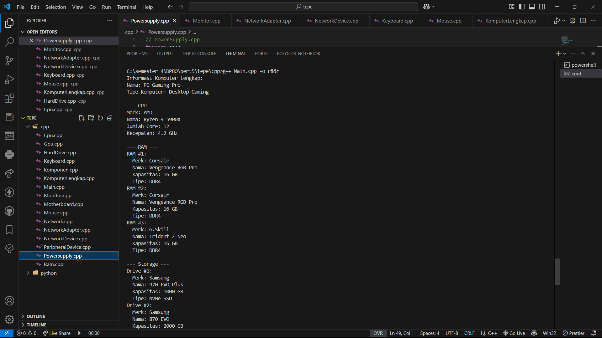

# TP3DPBO2025C2

## Janji
Saya Yattaqi Ahmad Faza dengan NIM 2311216 mengerjakan Tugas Praktikum 3 dalam mata kuliah Desain Pemrograman Berorientasi Objek untuk keberkahanNya maka saya tidak melakukan kecurangan seperti yang telah dispesifikasikan. Aamiin.

## Deskripsi Tugas
Tugas Praktikum 3 ini mengimplementasikan konsep Multi-level Inheritance dan Composition dalam desain sistem komputer menggunakan bahasa pemrograman C++ dan Python. Program ini memodelkan berbagai komponen komputer dan hubungan di antara komponen tersebut.

## Desain Program

### Relasi Antar Class
Program ini mengimplementasikan konsep inheritance dari class induk Komponen, serta konsep composition dalam class KomputerLengkap yang merangkai semua komponen menjadi sistem yang utuh.

### Penjelasan Class

#### 1. Class Komponen (Base/Parent Class)
Class dasar yang menjadi induk dari semua komponen komputer.

**Atribut:**
- `mark` - String untuk menyimpan merek komponen
- `name` - String untuk menyimpan nama komponen

**Method:**
- Setter dan getter untuk semua atribut (`setMark()`, `getMark()`, `setName()`, `getName()`)

#### 2. Class-Class Turunan Komponen

##### RAM (Inherits from Komponen)
**Atribut tambahan:**
- `kapasitasGB` - Integer untuk kapasitas RAM dalam GB
- `tipe` - String untuk tipe RAM (DDR3, DDR4, dll)
- `modular` - Boolean yang menandakan apakah RAM bersifat modular

**Method:**
- Setter dan getter untuk atribut tambahan

##### Power Supply (Inherits from Komponen)
**Atribut tambahan:**
- `wattage` - Integer untuk daya dalam watt
- `certification` - String untuk sertifikasi (Bronze, Gold, Platinum)
- `modular` - Boolean yang menandakan apakah power supply bersifat modular

**Method:**
- Setter dan getter untuk atribut tambahan

##### CPU (Inherits from Komponen)
**Atribut tambahan:**
- `jumlahCore` - Integer untuk jumlah core
- `kecepatan` - Float untuk kecepatan dalam GHz

**Method:**
- Setter dan getter untuk atribut tambahan

##### GPU (Inherits from Komponen)
**Atribut tambahan:**
- `vramGB` - Integer untuk kapasitas VRAM dalam GB
- `architectureType` - String untuk tipe arsitektur
- `supportRayTracing` - Boolean untuk mendukung ray tracing

**Method:**
- Setter dan getter untuk atribut tambahan

##### Hard Drive (Inherits from Komponen)
**Atribut tambahan:**
- `kapasitasGD` - Integer untuk kapasitas dalam GB
- `tipeDrive` - String untuk tipe drive (SSD, HDD)

**Method:**
- Setter dan getter untuk atribut tambahan

##### Keyboard (Inherits from Komponen)
**Atribut tambahan:**
- `mechanical` - Boolean untuk jenis mechanical
- `layoutType` - String untuk tipe layout (Full, TKL)
- `hasBacklight` - Boolean untuk ketersediaan lampu backlight

**Method:**
- Setter dan getter untuk atribut tambahan

##### Monitor (Inherits from Komponen)
**Atribut tambahan:**
- `sizeInch` - Integer untuk ukuran dalam inci
- `resolution` - String untuk resolusi layar
- `refreshRate` - Integer untuk refresh rate dalam Hz

**Method:**
- Setter dan getter untuk atribut tambahan

##### Motherboard (Inherits from Komponen)
**Atribut tambahan:**
- `chipset` - String untuk jenis chipset
- `formFactor` - String untuk bentuk fisik (ATX, microATX)
- `maxRamSlots` - Integer untuk jumlah slot RAM

**Method:**
- Setter dan getter untuk atribut tambahan

##### Mouse (Inherits from Komponen)
**Atribut tambahan:**
- `dpi` - Integer untuk DPI mouse
- `buttonCount` - Integer untuk jumlah tombol
- `isGaming` - Boolean untuk indikasi apakah mouse untuk gaming

**Method:**
- Setter dan getter untuk atribut tambahan

#### 3. Class-Class Turunan dari PeripheralDevice

##### PeripheralDevice (Inherits from Komponen)
**Atribut tambahan:**
- `interfaceType` - String untuk tipe interface (USB, Bluetooth)
- `isWireless` - Boolean untuk indikasi koneksi wireless

**Method:**
- Setter dan getter untuk atribut tambahan

#### 4. Class-Class Turunan dari NetworkDevice

##### NetworkDevice (Inherits from Komponen)
**Atribut tambahan:**
- `networkProtocol` - String untuk protokol jaringan
- `speedMbps` - Float untuk kecepatan dalam Mbps

**Method:**
- Setter dan getter untuk atribut tambahan

##### NetworkAdapter (Inherits from NetworkDevice)
**Atribut tambahan:**
- `isWifi` - Boolean untuk indikasi WiFi
- `isBluetooth` - Boolean untuk indikasi Bluetooth
- `macAddress` - String untuk MAC address

**Method:**
- Setter dan getter untuk atribut tambahan

#### 5. Class KomputerLengkap (Composition Class)
Class yang merangkai semua komponen menjadi satu sistem komputer lengkap.

**Atribut:**
- `name` - String untuk nama komputer
- `cpu` - Objek CPU
- `gpu` - Objek GPU
- `motherboard` - Objek Motherboard
- `ram` - Vector objek Ram
- `harddriveList` - Vector objek HardDrive
- `powerSupply` - Objek PowerSupply
- `monitor` - Objek Monitor
- `networkAdapter` - Objek NetworkAdapter
- `keyboard` - Objek Keyboard
- `mouse` - Objek Mouse

**Method:**
- Setter dan getter untuk semua atribut komponen
- `displayInfo()` - Method untuk menampilkan informasi komputer lengkap

## Alur Program

1. Program membuat berbagai objek komponen komputer (CPU, GPU, RAM, dll)
2. Program merakit komponen-komponen tersebut dalam objek KomputerLengkap
3. Program menampilkan spesifikasi lengkap komputer yang telah dirakit
4. Jika diperlukan, program dapat memodifikasi spesifikasi komponen tertentu dan menampilkan perubahan

## Implementasi Konsep OOP

1. **Inheritance:**
   - Multi-level inheritance dari class Komponen ke berbagai komponen komputer
   - Hierarchical inheritance untuk device spesifik seperti PeripheralDevice dan NetworkDevice

2. **Encapsulation:**
   - Semua atribut bersifat private dan diakses melalui method getter dan setter

3. **Composition:**
   - Class KomputerLengkap mengandung/terdiri dari objek-objek komponen lainnya
   - Penggunaan vector untuk komponen yang mungkin memiliki lebih dari satu instance (RAM, HardDrive)

4. **Polymorphism:**
   - Override method pada class turunan sesuai kebutuhan

dokumentasi CPP:

dokumentasi Py:
